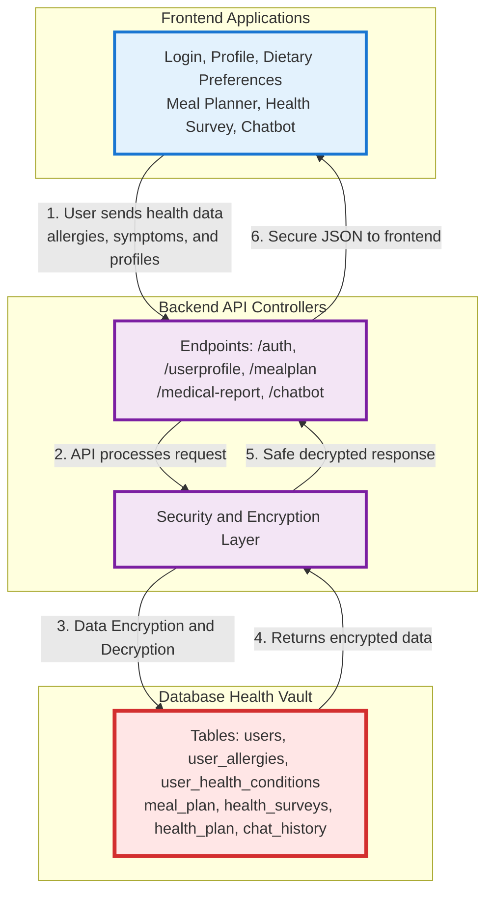

# Nutri-Help Data Discovery Report: Week 1

### Data Flow Overview (Mermaid Diagram)

### 1. Data Inventory Table
| Data Type                  | Supabase Table Name       | Backend Files (controllers/services/routes) | Frontend Files & API Calls                  | Transmission Points (endpoints) | Risk Level (High/Medium) |
| :--- | :--- | :--- | :--- | :--- | :--- |
| User profile & identity | `users`, `images` | `Nutrihelp-api/controller/authController.js`, `Nutrihelp-api/controller/userProfileController.js`, `Nutrihelp-api/controller/updateUserProfileController.js`, `Nutrihelp-api/routes/userprofile.js`, `Nutrihelp-api/routes/auth.js` | `Nutrihelp-web/src/routes/UI-Only-Pages/UserProfilePage/userprofile.jsx` (`fetch("http://localhost:80/api/profile")`), `Nutrihelp-web/src/routes/Login/Login.jsx` (`fetch(${API_BASE}/api/login)`) | `/api/login`, `/api/userprofile`, `/api/auth/profile` | High |
| User preference (allergy/health conditions + diet prefs) | `user_allergies`, `user_health_conditions`, `user_dietary_requirements`, `user_dislikes`, `user_cuisines`, `user_spice_levels`, `user_cooking_methods` | `Nutrihelp-api/controller/userPreferencesController.js`, `Nutrihelp-api/routes/userPreferences.js`, `Nutrihelp-api/routes/index.js` (`/api/user/preferences`) | `Nutrihelp-web/src/routes/UI-Only-Pages/DietaryRequirements/DietaryRequirements.jsx` (`fetch('http://localhost:80/api/userPreference')`) | `/api/user/preferences` | High |
| Allergy catalog and ingredient allergen mappings | `allergies`, `allergens_new`, `ingredient_allergens`, `ingredient_allergies`, `ingredients`, `recipe_ingredient` | `Nutrihelp-api/controller/filterController.js`, `Nutrihelp-api/controller/shoppingListController.js`, `Nutrihelp-api/routes/allergyRoutes.js`, `Nutrihelp-api/routes/fooddata.js` | `Nutrihelp-web/src/routes/ScanBarcode/ScanBarcode.jsx` (`fetch('http://localhost:80/api/barcode?...')`) | `/api/allergy/common`, `/api/allergy/check`, `/api/fooddata/allergies`, `/api/barcode` | High |
| Meal planning data | `meal_plan`, `recipe_meal`, `recipes` | `Nutrihelp-api/controller/mealplanController.js`, `Nutrihelp-api/controller/accountController.js`, `Nutrihelp-api/routes/mealplan.js`, `Nutrihelp-api/routes/account.js` | `Nutrihelp-web/src/routes/Account/Account.js` (`fetch('http://localhost:80/api/account?...')`), `Nutrihelp-web/src/routes/Meal/WeeklyMealUtils.js` (`supabase.from('weeklyrecipes')`, `supabase.from('weekly_recipe_ingredient')`) | `/api/mealplan`, `/api/account` | High |
| Shopping list derived from meal plans | `shopping_lists`, `shopping_list_items`, `ingredient_price`, `recipe_meal` | `Nutrihelp-api/controller/shoppingListController.js`, `Nutrihelp-api/routes/shoppingList.js`, `Nutrihelp-api/routes/index.js` (`/api/shopping-list`) | (No direct active FE API call in notes; backend endpoints and tests present) | `/api/shopping-list` | High |
| Medical survey and generated health plans | `health_surveys`, `health_plan`, `health_plan_weekly`, `health_risk_reports` | `Nutrihelp-api/controller/healthPlanController.js`, `Nutrihelp-api/routes/medicalPrediction.js`, `Nutrihelp-api/routes/index.js` (`/api/medical-report`) | `Nutrihelp-web/src/routes/survey/ObesityPredictor.jsx` (`fetch('http://localhost:8000/ai-model/medical-report/retrieve')`), `Nutrihelp-web/src/routes/survey/FitnessRoadmap.jsx` (`fetch('http://localhost:8000/ai-model/medical-report/plan/generate')`) | `/api/medical-report/retrieve`, `/api/medical-report/plan` | High |
| Nutrition and recipe nutrient data | `recipes`, `ingredients` | `Nutrihelp-api/controller/recipeNutritionController.js`, `Nutrihelp-api/routes/recipeNutritionlog.js`, `Nutrihelp-api/routes/index.js` (`/api/recipe/nutritionlog`) | `Nutrihelp-web/src/services/recepieApi.js` (`fetch(${baseURL}/fooddata/ingredients)`, recipe endpoints) | `/api/recipe/nutritionlog`, `/api/recipe`, `/api/fooddata/ingredients` | Medium |
| Health articles/news content | `health_articles`, `health_news`, `news_tags`, `authors`, `categories`, `tags` | `Nutrihelp-api/controller/healthNewsController.js`, `Nutrihelp-api/controller/healthArticleController.js`, `Nutrihelp-api/routes/healthNews.js` | `Nutrihelp-web/src/routes/HealthNews/HealthNews.js` (`supabase`), `Nutrihelp-web/src/routes/HealthNews/NewsDetail.js` (`supabase.from('health_news')`) | `/api/health-news`, `/api/articles` | Medium |
| Chat-based health interactions/history | `chat_history` | `Nutrihelp-api/controller/chatbotController.js`, `Nutrihelp-api/routes/chatbot.js`, `Nutrihelp-api/routes/index.js` (`/api/chatbot`) | (No active FE chatbot API call in provided notes; backend route/controller/test evidence present) | `/api/chatbot/query`, `/api/chatbot/history`, `/api/chatbot/add_urls`, `/api/chatbot/add_pdfs` | High |
| Water intake wellness tracking | `water_intake` | `Nutrihelp-api/controller/waterIntakeController.js`, `Nutrihelp-api/routes/index.js` (`/api/water-intake`) | (No FE call shown in provided raw notes) | `/api/water-intake` | Medium |

### 2. Summary of Sensitive Data Locations
- **Supabase tables storing health/allergy/meal/medical-related data (from search output):**
    - `meal_plan`, `recipe_meal`, `recipes`, `recipe_ingredient`
    - `user_allergies`, `allergies`, `allergens_new`, `ingredient_allergens`, `ingredient_allergies`
    - `health_conditions`, `health_conditions_new`, `user_health_conditions`
    - `health_surveys`, `health_plan`, `health_plan_weekly`, `health_risk_reports`
    - `shopping_lists`, `shopping_list_items`, `ingredient_price`
    - `health_articles`, `health_news`, `news_tags`, `authors`, `categories`, `tags`
    - `chat_history`, `water_intake`

- **Key backend files reading/writing this data:**
    - `Nutrihelp-api/controller/mealplanController.js`
    - `Nutrihelp-api/controller/shoppingListController.js`
    - `Nutrihelp-api/controller/userProfileController.js`
    - `Nutrihelp-api/controller/updateUserProfileController.js`
    - `Nutrihelp-api/controller/userPreferencesController.js`
    - `Nutrihelp-api/controller/healthPlanController.js`
    - `Nutrihelp-api/controller/healthNewsController.js`
    - `Nutrihelp-api/controller/recipeNutritionController.js`
    - `Nutrihelp-api/controller/chatbotController.js`
    - `Nutrihelp-api/services/securityEvents/securityEventsService.js`
    - `Nutrihelp-api/routes/index.js`, `routes/mealplan.js`, `routes/userprofile.js`, `routes/userPreferences.js`, `routes/shoppingList.js`, `routes/medicalPrediction.js`, `routes/chatbot.js`, `routes/healthNews.js`, `routes/recipeNutritionlog.js`

- **Key frontend files sending/receiving this data:**
    - `Nutrihelp-web/src/routes/Login/Login.jsx`
    - `Nutrihelp-web/src/routes/MFA/MFAform.jsx`
    - `Nutrihelp-web/src/routes/UI-Only-Pages/UserProfilePage/userprofile.jsx`
    - `Nutrihelp-web/src/routes/UI-Only-Pages/DietaryRequirements/DietaryRequirements.jsx`
    - `Nutrihelp-web/src/routes/Account/Account.js`
    - `Nutrihelp-web/src/routes/Meal/WeeklyMealUtils.js`
    - `Nutrihelp-web/src/routes/ScanBarcode/ScanBarcode.jsx`
    - `Nutrihelp-web/src/routes/survey/ObesityPredictor.jsx`
    - `Nutrihelp-web/src/routes/survey/FitnessRoadmap.jsx`
    - `Nutrihelp-web/src/routes/HealthNews/HealthNews.js`, `Nutrihelp-web/src/routes/HealthNews/NewsDetail.js`

### 3. Transmission Flow Summary
- User authenticates from `Nutrihelp-web/src/routes/Login/Login.jsx` via `POST /api/login`; backend auth/profile handling is mapped in `Nutrihelp-api/routes/index.js`, `routes/auth.js`, and `controller/authController.js`.
- Profile data is fetched in `Nutrihelp-web/src/routes/UI-Only-Pages/UserProfilePage/userprofile.jsx` and served from backend profile routes/controllers (`/api/userprofile`, `/api/auth/profile`).
- Meal-related user data flows through `Nutrihelp-web/src/routes/Account/Account.js` (`GET /api/account`) into `Nutrihelp-api/controller/accountController.js`, which queries meal-plan records (`meal_plan` + recipe resolution).
- Preference and allergy/health-condition selections are sent from `DietaryRequirements.jsx` and processed by backend user-preference endpoints (`/api/user/preferences`) that update user-linked preference tables.
- Medical-report and plan-generation data flows from frontend survey pages (`ObesityPredictor.jsx`, `FitnessRoadmap.jsx`) to AI endpoints and backend medical-report routes (`/api/medical-report/retrieve`, `/api/medical-report/plan`); chatbot health queries flow through `/api/chatbot/query` and are persisted in `chat_history`.

### 4. Current Security Status Check (TLS & Encryption)

**TLS Version**  
- Current setup uses plain HTTP (port 80) with no forced TLS.  
- Browser Network tab shows **HTTP/1.1** or **h2** without TLS 1.3 enforcement.  
- No HSTS headers or redirect rules are present.  
→ **Conclusion**: TLS 1.3 must be explicitly enforced in Week 3.

**Database Encryption Status**  
- Global search for `encrypt`, `aes`, `crypto`, `pgcrypto`, and `vault` returned **zero relevant results** in the codebase.  
- All sensitive columns (`user_allergies`, `meal_plan`, `health_surveys`, `chat_history`, etc.) are stored in plain text.  
- No column-level encryption or Supabase Vault usage detected.  
→ **Conclusion**: Full AES-256 encryption at rest is required.

### 5. Quick Risk Notes
- Leakage of `health_surveys`, `health_plan`, `health_risk_reports`, `user_allergies`, and `meal_plan` can expose sensitive medical and behavioral profiles tied to user identity.
- Exposure of transmission paths that include profile and preference endpoints increases risk of unauthorized correlation between identity (`users`) and health attributes (`user_health_conditions`, `user_allergies`).
- Interception of shopping-list/meal-plan data (`shopping_lists`, `shopping_list_items`, `ingredient_price`) can reveal diet patterns and inferred conditions/allergies.
- Chat and AI-related flows (`/api/chatbot/query`, medical-report endpoints) may contain free-text health disclosures that become high-impact if logs/history are accessed.
- Endpoint inconsistency found in raw notes (frontend calls like `/api/profile` and `/api/userPreference` vs backend route registrations `/api/userprofile` and `/api/user/preferences`) increases misrouting and accidental data exposure risk during implementation/debugging.

### 6. Key Recommendations
1. **High-priority tables for AES-256 encryption**: `users`, `user_allergies`, `user_health_conditions`, `meal_plan`, `health_surveys`, `health_plan`, `chat_history`.
2. Force TLS 1.3 on all API endpoints (especially medical-report and chatbot routes).
3. Ensure decryption happens **only in backend** — never expose raw sensitive data to frontend.
4. Fix route inconsistencies (`/api/profile` vs `/api/userprofile`) to prevent accidental data exposure.
5. Add Row-Level Security (RLS) review for all health-related tables before encryption.
