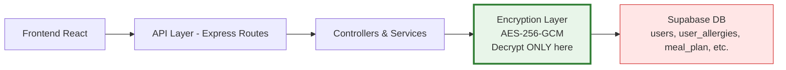

# Week 2 – Encryption Scope Finalisation & Team Alignment
**Project:** TLS 1.3 + AES-256 Encryption at Rest for Nutri-Help  
**Date:** 14-March-2026  
**Lead:** Ifunanya Chukwudum – Cyber Security Lead  
**Status:** Proposed (sent to Backend & AI Leads on 14-March-2026 for confirmation)

### 1. Confirmed Scope (Based on Week 1 Discovery + Research)
We will implement:
- **TLS 1.3 enforcement** on all frontend ↔ backend communications
- **AES-256-GCM encryption at rest** for these high-risk tables:
  - `users`
  - `user_allergies`
  - `user_health_conditions`
  - `health_surveys`
  - `health_plan`
  - `chat_history`
  - `meal_plan`

### 2. Chosen Technical Architecture
- Backend-only encryption using Node.js `crypto` module (AES-256-GCM)
- Hybrid key storage: Supabase Vault for master key + .env / GitHub Secrets
- Key versioning (`kid`) with staged rotation plan
- Decryption happens **only in backend** (never frontend or direct DB access)

### 3. Out of Scope This Trimester
- Full re-encryption of historical data (Phase 2)
- Frontend changes
- AI prompt-injection filters (can be added later)

### 4. Risks & Mitigations
- Performance on AI endpoints → Selective encryption + short-term caching
- Key exposure → Backend-only logic + Vault + strict RLS
- Route inconsistencies → Will be fixed during implementation

### 5. Updated Threat Model (with Encryption Layer)

