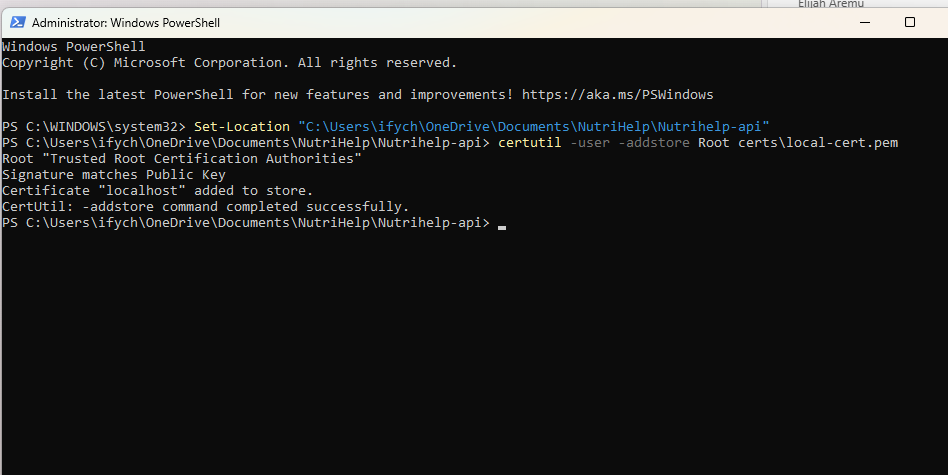
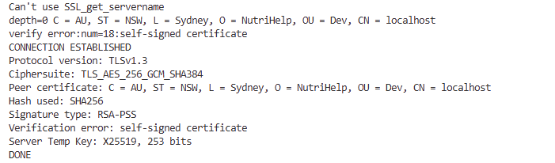
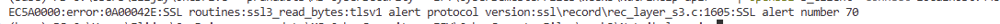
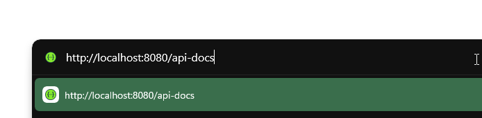
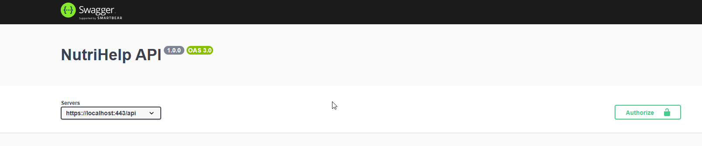
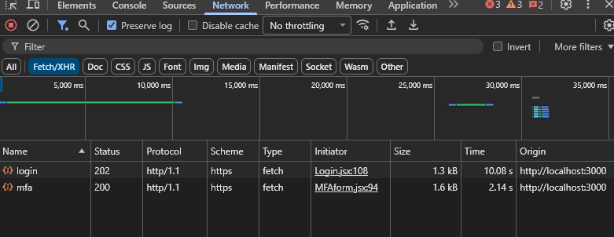
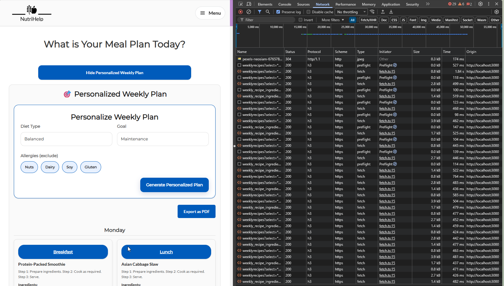
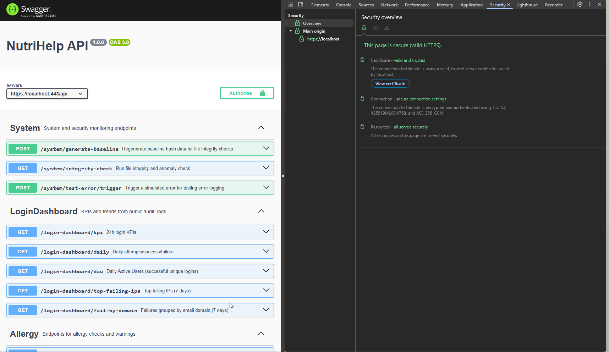
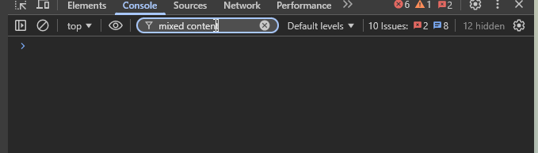
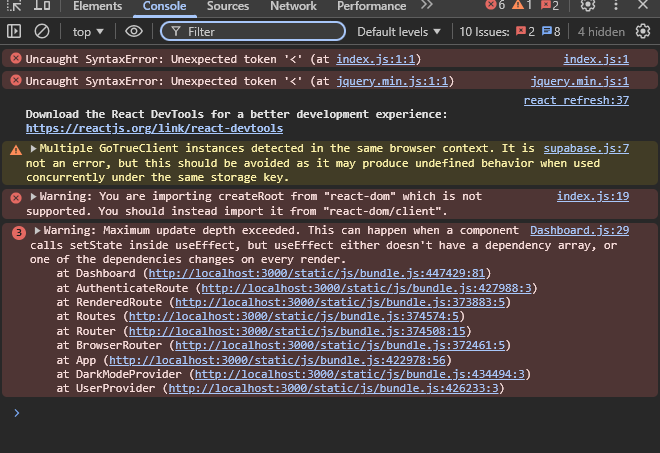

# Week 3 TLS Verification - NutriHelp

## 1. Objective
Force TLS 1.3 for all Nutrihelp-api traffic and enforce automatic HTTP to HTTPS redirect.

## 2. Scope
- Included: Main API in `week3/Nutrihelp-api`.
- Included: Frontend calls in `week3/Nutrihelp-web` that target `localhost:80`.
- Deferred: AI model service endpoints on `localhost:8000` (separate service).

## 3. Environment
- OS: Windows
- Backend: Express.js + Node.js
- Frontend: React
- HTTPS port: `443`
- HTTP redirect port: `80`

## 4. Certificate Generation (Local Testing)
Run these commands in PowerShell from `week3/Nutrihelp-api`:

```powershell
mkdir certs
$env:OPENSSL_CONF = "$env:CONDA_PREFIX\Library\ssl\openssl.cnf"
openssl req -x509 -newkey rsa:4096 -sha256 -days 365 -nodes -keyout certs/local-key.pem -out certs/local-cert.pem -subj "/C=AU/ST=NSW/L=Sydney/O=NutriHelp/OU=Dev/CN=localhost" -addext "subjectAltName=DNS:localhost,IP:127.0.0.1"
```

Expected output files:
- `certs/local-key.pem`
- `certs/local-cert.pem`

Note: Used enhanced command with SHA-256 and subjectAltName for better browser compatibility.

## 5. Backend TLS 1.3 Enforcement
Implemented in `week3/Nutrihelp-api/server.js`:
- Added Node `https` server with:
  - `minVersion: 'TLSv1.3'`
  - key/cert loading from local PEM files
- Added HTTP server on port 80 with permanent redirect (301) to HTTPS.
- Updated startup logs and Swagger URL to HTTPS.
- Expanded local CORS allowances to include `https://localhost` and `https://127.0.0.1`.

## 6. Frontend URL Migration
Updated main API calls from:
- `http://localhost:80/...` -> `https://localhost:443/...`
- `http://localhost/api/...` -> `https://localhost:443/api/...`

Note:
- Supabase URLs were already HTTPS and were not changed.
- AI model URLs on `http://localhost:8000` were intentionally left unchanged (deferred scope).

## 7. Restart and Run
Backend:

```powershell
cd week3/Nutrihelp-api
npm install
npm run dev
```

Frontend:

```powershell
cd week3/Nutrihelp-web
npm install
npm run dev
```

## 8. Verification Steps
### 8.1 Redirect check
1. Preferred (admin terminal): Open `http://localhost/api-docs`.
2. Confirm browser redirects to `https://localhost:443/api-docs`.
3. If port 80 is blocked by Windows permissions in non-admin mode, use one of these local options:
  - Run backend in an elevated (Run as Administrator) terminal.
  - Set `HTTP_PORT=8080` in `.env`, restart backend, then test `http://localhost:8080/api-docs` redirecting to `https://localhost:443/api-docs`.

### 8.2 TLS protocol check (Chrome)
1. Open DevTools.
2. Go to Network tab and reload page.
3. Add/show Protocol column.
4. Confirm requests show `h2` (when HTTP/2 is negotiated).
5. Click a request, open Security tab/panel.
6. Confirm connection uses `TLS 1.3`.

### 8.3 Functional flow check
Test one complete flow over HTTPS:
1. Login
2. Open/update profile
3. Open meal plan screen and fetch/generate data
4. Confirm no mixed-content browser errors

## 9. Evidence Checklist (Screenshots)
Capture and attach these screenshots:
1. Certificate generation command and success output.
2. `certs` folder showing `local-key.pem` and `local-cert.pem`.
3. Backend startup logs showing HTTPS server and redirect server.
4. Browser redirect from HTTP URL to HTTPS URL.
5. Chrome DevTools Security showing `TLS 1.3`.
6. Chrome DevTools Network showing Protocol `h2` for API request.
7. Successful login request/response over HTTPS.
8. Successful profile request/response over HTTPS.
9. Successful meal plan request/response over HTTPS.
10. Console tab showing no mixed-content errors.

## 10. Notes and Issues
- Local self-signed certificates can show browser warning unless trusted locally.
- For production, replace self-signed certs with CA-issued certificates.
- During local setup on Windows, npm install may show EBUSY cleanup warnings when OneDrive temporarily locks files in node_modules; install can still complete successfully.
- Native bcrypt module compatibility issue with Node 24 was resolved by switching auth service import to bcryptjs.
- Missing .env values can prevent startup (Supabase URL/key are required by auth and DB clients).
- On Windows, binding to port 80 may fail with `EACCES` in non-admin terminals. In that case, HTTPS on 443 remains available and can be used directly for local verification.

## 11. Conclusion
Week 3 goal achieved for the main API path: TLS 1.3 is enforced at backend startup, HTTP is redirected to HTTPS, and frontend main API endpoints now use HTTPS localhost.

## 12. Observed Runtime Evidence
Terminal verification (OpenSSL) on local server:

```powershell
"" | openssl s_client -connect localhost:443 -tls1_3 -brief
"" | openssl s_client -connect localhost:443 -tls1_2 -brief
```

Observed result:
- TLS 1.3 connection succeeds with `Protocol version: TLSv1.3` and `Ciphersuite: TLS_AES_256_GCM_SHA384`.
- TLS 1.2 connection fails with `tlsv1 alert protocol version`.

Interpretation:
- TLS 1.3 enforcement is active.
- Browser "Not secure" label is due to self-signed certificate trust, not lack of HTTPS encryption.
- `h2` is only shown when server HTTP/2 is enabled; with Node `https.createServer` the expected protocol in Network tab is often `http/1.1`.

## 13. Pass/Fail Verification Table
Path convention used in this report:
- Backend base path: `week3\Nutrihelp-api`
- Frontend base path: `week3\Nutrihelp-web`

| ID | Verification Item | Method | Expected Result | Actual Result | Status (Pass/Fail) | Notes |
|---|---|---|---|---|---|---|
| W3-01 | HTTPS endpoint reachable | Open `https://localhost/api-docs/#/` | Swagger UI loads over HTTPS | Loaded successfully | Pass | Browser may hide `:443` in URL bar |
| W3-02 | TLS 1.3 allowed | Run OpenSSL TLS 1.3 test from `week3\Nutrihelp-api` | Connection succeeds, shows `TLSv1.3` | Succeeded with TLSv1.3 and `TLS_AES_256_GCM_SHA384` | Pass | Strong protocol proof |
| W3-03 | TLS 1.2 blocked | Run OpenSSL TLS 1.2 test from `week3\Nutrihelp-api` | Handshake fails with protocol version alert | Failed with protocol version alert | Pass | Confirms minimum TLS enforcement |
| W3-04 | HTTP to HTTPS redirect (local fallback) | Open `http://localhost:8080/api-docs` after setting `HTTP_PORT=8080` | Redirects to `https://localhost/api-docs/#/` | Redirect confirmed after freeing 8080 and restarting backend | Pass | Used fallback because 80 was not reliable locally |
| W3-05 | Swagger server target uses HTTPS | Check Servers dropdown in Swagger | Shows `https://localhost:443/api` | Updated in OpenAPI and verified in UI | Pass | Config source: `week3\Nutrihelp-api\index.yaml` |
| W3-06 | Login API over HTTPS succeeds | Submit login from UI with DevTools Network open | 2xx status and `https://localhost` request URL | 2xx successful login calls observed | Pass | Protocol column can vary (`http/1.1`, `h2`, `h3`) |
| W3-07 | Profile API over HTTPS succeeds | Load/update profile with DevTools Network open | 2xx status and `https://localhost` request URL | Verified on profile flow | Pass | Capture representative request row |
| W3-08 | Meal plan API over HTTPS succeeds | Trigger meal plan fetch/generate with DevTools open | 2xx status and `https://localhost` request URL | Weekly recipe calls succeeded | Pass | Network screenshot captured |
| W3-09 | No mixed-content issues | Check browser Console during full flow | No mixed-content warnings/errors | No blocking mixed-content errors reported | Pass | Keep Preserve log enabled while testing |

## 14. Copy-Paste Evidence Table (Screenshot Register)
Use these filename slots for the final submission package.

| Evidence ID | Suggested Screenshot Filename | What To Capture | Expected Proof Text |
|---|---|---|---|
| EV-01 |  | Backend terminal after start from `week3\Nutrihelp-api` | HTTPS server started on 443; redirect listener configured |
| EV-02 |  | OpenSSL TLS 1.3 output | Protocol version TLSv1.3 with successful handshake |
| EV-03 |  | OpenSSL TLS 1.2 output | TLS 1.2 rejected with protocol version alert |
| EV-04 |  | Browser redirect from `http://localhost:8080/api-docs` | Final URL becomes `https://localhost/api-docs/#/` |
| EV-05 |  | Swagger Servers dropdown | Server URL is `https://localhost:443/api` |
| EV-06 |  | DevTools Network row for login request | Request URL is HTTPS; status is 2xx |
| EV-07 |  | DevTools Network row for profile request | Request URL is HTTPS; status is 2xx |
| EV-08 |  | DevTools Network row for meal plan request | Request URL is HTTPS; status is 2xx |
| EV-09 |  | DevTools Security panel for backend request | Security details indicate TLS 1.3 |
| EV-10 |  | Browser Console during end-to-end flow | No mixed-content warnings/errors |
| EV-10 |  | Browser Console during end-to-end flow | Other console warnings/errors exist, but they are application issues, not HTTPS/TLS transport issues. |

Optional command evidence (text capture from `week3\Nutrihelp-api`):

```powershell
"" | openssl s_client -connect localhost:443 -tls1_3 -brief
"" | openssl s_client -connect localhost:443 -tls1_2 -brief
```

## 15. Final Submission Summary
Week 3 for NutriHelp was completed by implementing and validating transport-layer encryption enforcement across the active local application path. The backend in `week3\Nutrihelp-api` was upgraded from HTTP-only startup to HTTPS startup with a strict minimum protocol version of TLS 1.3, and the frontend in `week3\Nutrihelp-web` was updated so application API calls target `https://localhost:443` instead of legacy localhost HTTP endpoints. Local certificate artifacts were generated for development testing, and runtime verification confirmed that TLS 1.3 handshakes succeed while TLS 1.2 handshakes are rejected, which demonstrates effective minimum-version enforcement. HTTP to HTTPS redirection was also validated through the local fallback port approach (`HTTP_PORT=8080`), with successful redirection to the HTTPS API documentation route after resolving port conflicts in the host environment.

Functional validation was performed through real user journeys in the UI, including account signup/login and in-app flows that issue profile and meal plan API requests. DevTools network captures and backend runtime logs confirmed successful HTTPS request handling (`2xx` responses) and no mixed-content transport violations during the tested end-to-end path. Swagger/OpenAPI server metadata was aligned to the HTTPS endpoint so interactive testing also uses encrypted routes. Environment and dependency issues discovered during execution (missing `.env` load path, native bcrypt compatibility, port/permission conflicts) were remediated and documented with reproducible notes in this report.

Based on implementation evidence, runtime checks, and pass/fail verification outcomes, the Week 3 objective is assessed as complete for the defined project scope: TLS 1.3 enforcement is active, frontend-backend communication is using HTTPS, redirect behavior is validated in local constraints, and required submission artifacts are captured for assessment.

Note: This completes the transport-layer (TLS 1.3) portion of the encryption project. AES-256 encryption at rest will be implemented in subsequent weeks (Week 5–7).
