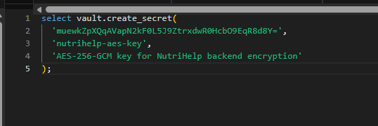
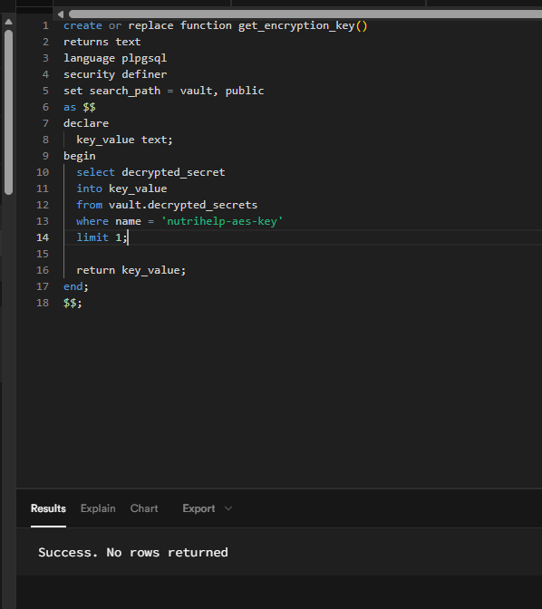
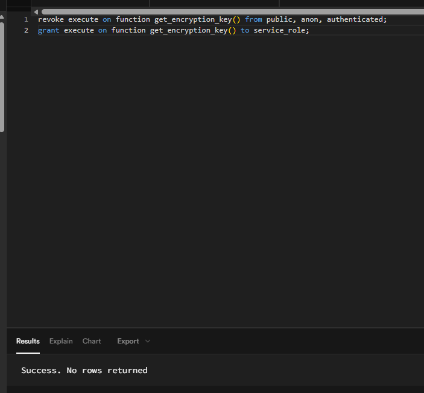
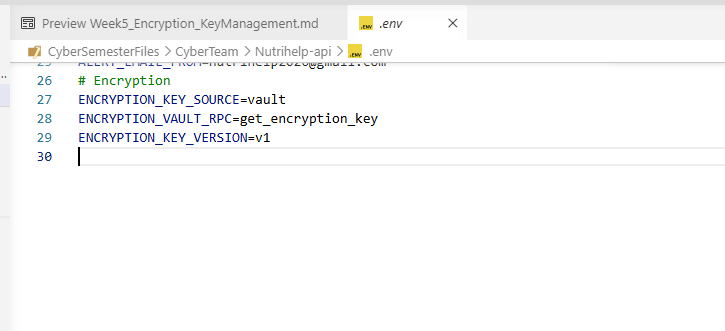
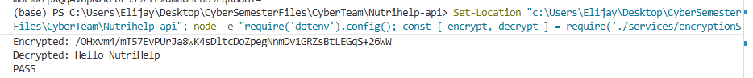

# Week 5 AES-256 Encryption Foundation & Key Management

## Scope

Objective: Set up the secure AES-256-GCM encryption service and key management infrastructure using Supabase Vault. This is the foundation for encrypting sensitive columns (user profiles, allergies, meal plans, etc.) in Weeks 6–7.

## 1. Implemented Components

1. Backend encryption service created at `Nutrihelp-api/services/encryptionService.js`.
2. AES-256-GCM implemented with IV + auth tag and key version support.
3. Supabase Vault key retrieval integrated via RPC.
4. Local environment configured to use Vault as key source.

The core encryption logic is implemented in `Nutrihelp-api/services/encryptionService.js` with `encrypt()` and `decrypt()` functions using `AES-256-GCM`

## 2. Exact Steps Completed (Step 1 to Step 9)

### Step 1: Generate AES-256 Key (PowerShell)

Run from `Nutrihelp-api`:

```powershell
node -e "console.log(require('crypto').randomBytes(32).toString('base64'))"
```

Outcome:
- Generated a base64 32-byte key (kept secret, not stored in this document).

### Step 2: Open Supabase SQL Editor

Outcome:
- SQL editor opened and ready for Vault setup queries.

### Step 3: Store Key in Supabase Vault

```sql
select vault.create_secret(
   '<BASE64_KEY_FROM_STEP_1>',
   'nutrihelp-aes-key',
   'AES-256-GCM key for NutriHelp backend encryption'
);
```

Outcome:
- Secret created in Vault under name `nutrihelp-aes-key`.

### Step 4: Create Key Retrieval RPC

```sql
create or replace function get_encryption_key()
returns text
language plpgsql
security definer
set search_path = vault, public
as $$
declare
   key_value text;
begin
   select decrypted_secret
   into key_value
   from vault.decrypted_secrets
   where name = 'nutrihelp-aes-key'
   limit 1;

   return key_value;
end;
$$;
```

Outcome:
- Function created successfully (expected SQL result: success with no rows returned).

### Step 5: Lock Down RPC Permissions

```sql
revoke execute on function get_encryption_key() from public, anon, authenticated;
grant execute on function get_encryption_key() to service_role;
```

Outcome:
- Only `service_role` can execute key retrieval RPC.

### Step 6: Configure `.env` for Vault Mode

Add to `Nutrihelp-api/.env`:

```env
ENCRYPTION_KEY_SOURCE=vault
ENCRYPTION_VAULT_RPC=get_encryption_key
ENCRYPTION_KEY_VERSION=v1
```

Outcome:
- Backend configured to load key from Vault RPC.

### Step 7: Restart Backend Service

```powershell
taskkill /f /IM node.exe
Set-Location "<project-root>/Nutrihelp-api"; npm start
```

Outcome:
- Service restarted with updated environment configuration.

### Step 8: Validate Encrypt/Decrypt Round-Trip

```powershell
Set-Location "<project-root>/Nutrihelp-api"; node -e "require('dotenv').config(); const { encrypt, decrypt } = require('./services/encryptionService'); (async () => { const original = 'Hello NutriHelp'; const enc = await encrypt(original); console.log('Encrypted:', enc.encrypted); const dec = await decrypt(enc.encrypted, enc.iv, enc.authTag); console.log('Decrypted:', dec); console.log(dec === original ? 'PASS' : 'FAIL'); })();"
```

Expected/Observed:
- Prints encrypted value
- Prints `Decrypted: Hello NutriHelp`
- Prints `PASS`

### Step 9: Validate Vault RPC Reachability from Backend

```powershell
Set-Location "<project-root>/Nutrihelp-api"; node -e "require('dotenv').config(); const supabase = require('./database/supabaseClient'); (async () => { const { data, error } = await supabase.rpc(process.env.ENCRYPTION_VAULT_RPC || 'get_encryption_key'); if (error) { console.error('RPC FAIL:', error.message || error); process.exit(1); } const key = typeof data === 'string' ? data : Array.isArray(data) ? data[0]?.key || data[0]?.encryption_key || data[0] : data?.key || data?.encryption_key; console.log('RPC OK:', Boolean(key)); console.log('Key length (base64 chars):', key ? String(key).length : 0); })();"
```

Expected/Observed:
- `RPC OK: true`
- `Key length (base64 chars): 44`

## 3. Security Controls Applied

1. Key is not hard-coded and not stored in source control.
2. Vault secret is accessed by backend through `service_role` only.
3. Decryption path is backend-only.
4. Encryption metadata includes `keyVersion` to support future rotation.

## 4. Notes from Implementation

1. Vault RPC response can be plain text or object/array depending on query style; backend handling supports all expected shapes.
2. For direct terminal tests (`node -e`), include `require('dotenv').config()` so environment variables load before using encryption service.

## 5. Success Criteria (Week 5)
- [ ] AES-256-GCM encryption service created and working
- [ ] Key is stored securely in Supabase Vault
- [ ] Backend can retrieve key via RPC (service_role only)
- [ ] Encrypt → Decrypt round-trip test passes
- [ ] Vault RPC reachability test passes
- [ ] All evidence screenshots captured

## 6. Integration Notes for Week 6+

When storing encrypted fields in database rows, persist:

1. `encrypted` (ciphertext)
2. `iv` (nonce)
3. `auth_tag`
4. `key_version`

This enables authenticated decryption and safe key rotation later.


## 7. Task 1 Evidence Screenshots (Placeholders)

Add these screenshots before final submission:

| Step | Evidence Description | Expected Proof | Placeholder |
|---|---|---|---|
| 3 | Vault secret creation (`vault.create_secret`) | SQL executed successfully and secret name is `nutrihelp-aes-key` |  |
| 4 | RPC function creation (`get_encryption_key`) | Function created successfully (no rows returned) |  |
| 5 | RPC permission hardening (`revoke` + `grant service_role`) | Execute privilege removed from public roles and granted only to `service_role` |  |
| 6 | Environment configured for Vault mode | `.env` includes `ENCRYPTION_KEY_SOURCE`, `ENCRYPTION_VAULT_RPC`, `ENCRYPTION_KEY_VERSION` | ) |
| 8 | Encrypt/decrypt round-trip test | Terminal shows decrypted original value and `PASS` |  |
| 9 | Vault RPC reachability test | Terminal shows `RPC OK: true` and key length `44` |  |

## Next Steps (Week 6)
- Start encrypting sensitive database columns (user profiles, allergies, health conditions, meal plans).
- Update controllers to call `encryptionService.encrypt()` on write and `decrypt()` on read.
- Create migration scripts for existing data.